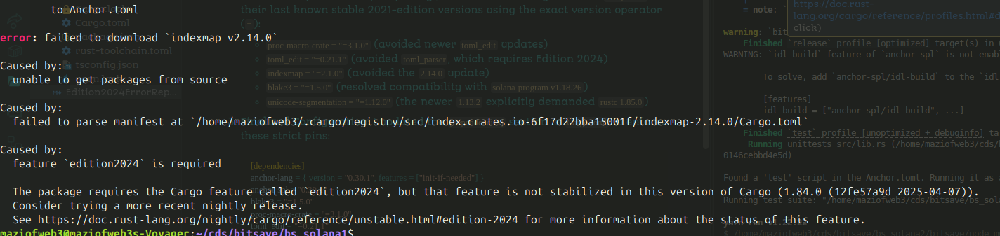

# Resolution of Rust "Edition 2024" Compilation Issues


While building the Solana smart contracts using the Anchor framework, I encountered a compilation error stating that the `edition2024` feature was required. This happened because the Solana toolchain (`solana-cargo-build-sbf`) currently uses an older Rust compiler (`1.84.1-dev`), whereas several foundational Rust crates have recently updated to require Rust's new 2024 edition (`rustc 1.85.0+`).

Here is the step-by-step approach I took to resolve the issue:

1. **Downgraded Core Anchor Dependencies:**
   I initially scaffolded the project with `anchor-lang` and `anchor-spl` version `0.32.1`, which pulled in the newest, incompatible dependency trees. I downgraded both to `0.30.1` to establish a more stable baseline.

2. **Pinned Transitive Dependencies:**
   Even with the older Anchor versions, Cargo was still resolving certain deep dependencies to their latest "Edition 2024" releases. To prevent this, I explicitly pinned the offending crates in `Cargo.toml` to their last known stable 2021-edition versions using the exact version operator (`=`):
   - `proc-macro-crate = "=3.1.0"` (avoided newer `toml_edit` updates)
   - `toml_edit = "=0.21.1"` (avoided `toml_parser`, which requires Edition 2024)
   - `indexmap = "=2.1.0"` (avoided the `2.14.0` update)
   - `blake3 = "=1.5.0"` (resolved compatibility with `solana-program v1.18.26`)
   - `unicode-segmentation = "=1.12.0"` (the newer `1.13.2` explicitly demanded `rustc 1.85.0`)

3. **Finalized Configuration:**
   I updated the `[dependencies]` section in `Cargo.toml` to enforce these strict pins:
   ```toml
   [dependencies]
   anchor-lang = { version = "0.30.1", features = ["init-if-needed"] }
   anchor-spl = "0.30.1"
   blake3 = "=1.5.0"
   proc-macro-crate = "=3.1.0"
   toml_edit = "=0.21.1"
   indexmap = "=2.1.0"
   unicode-segmentation = "=1.12.0"
   ```

By forcing Cargo to resolve the dependency graph using these specific older versions, I successfully bypassed the bleeding-edge ecosystem updates. This allowed the Solana compiler to process the entire protocol using the stable Rust 2021 edition, resulting in a successful build and passing tests.
